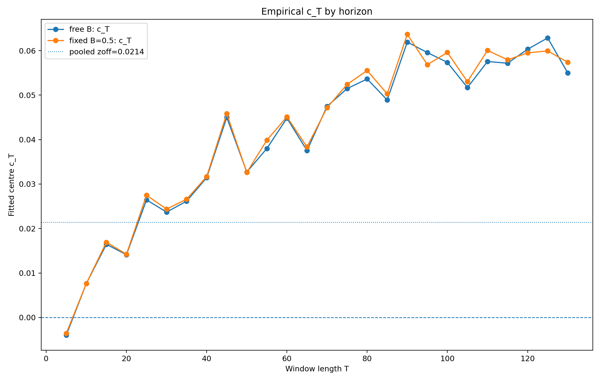
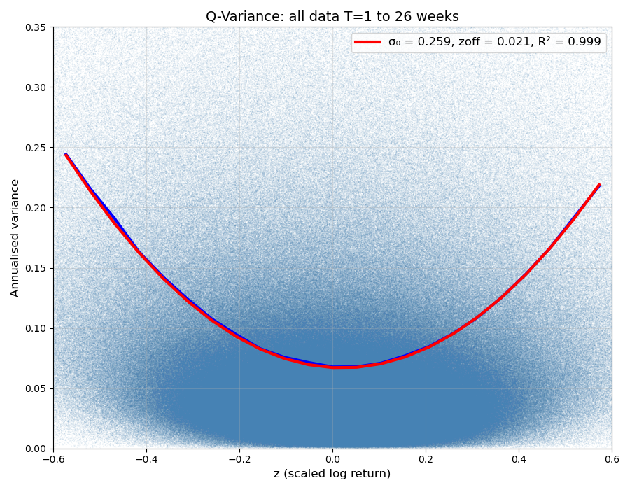
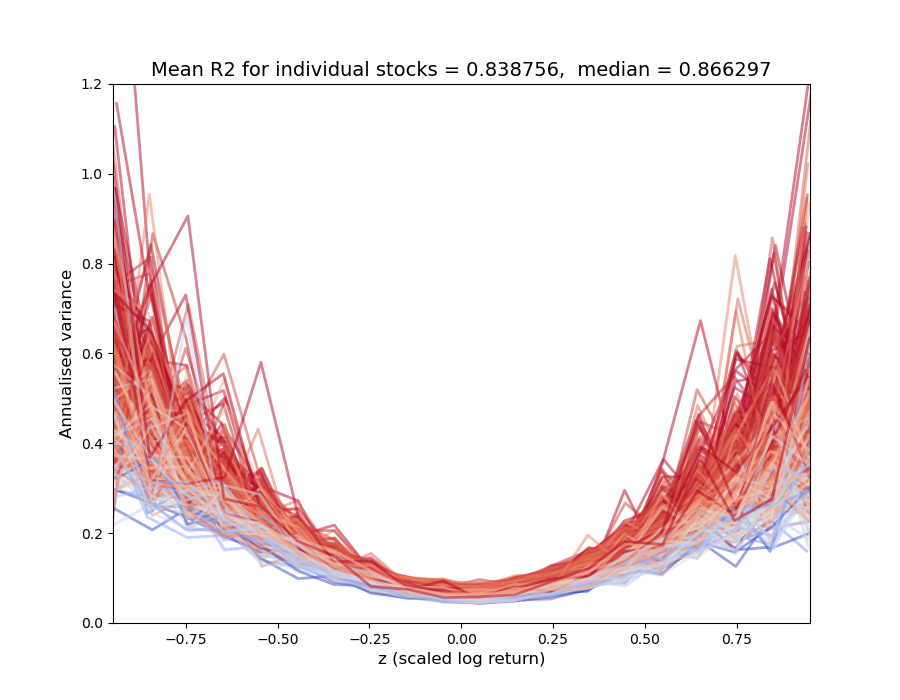
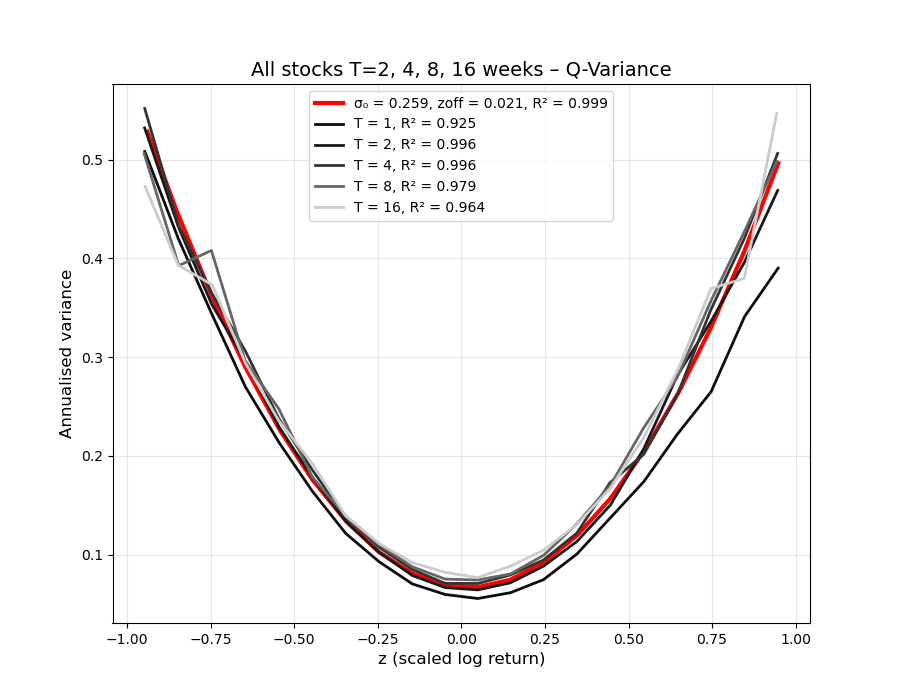
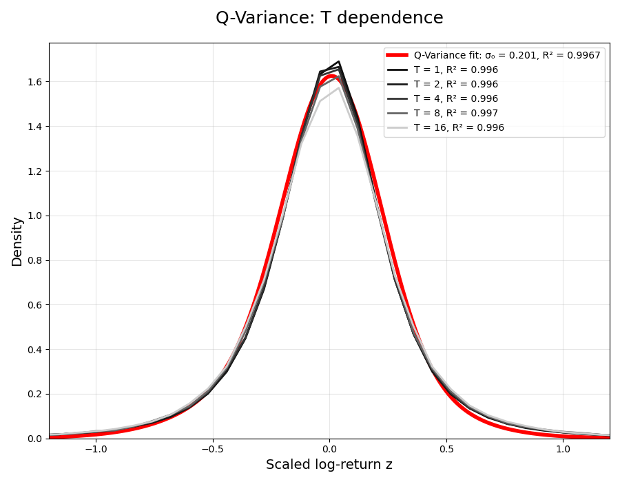

# Submission: Rank-truncated inverse-gamma multifractal q-variance 

## Team name

Rilwen

## Short summary

This submission is a three-parameter, competition-facing model designed to reproduce the pooled q-variance parabola.

The model is best described as a **rank-truncated inverse-gamma multifractal-style volatility model with a martingale-corrected skew transform**.

It is not intended to reproduce every detail of the empirical per-horizon family of parabolas. The empirical diagnostics suggest that the real data have a stable curvature $B_T$ and a horizon-dependent centre $c_T$. The fitted centre $c_T$ rises with horizon. The trend is almost identical whether $B_T$ is freely fitted or fixed at $B=0.5$, so the effect is not caused by a $B/c$ fitting tradeoff.



However, the competition target is the pooled q-variance curve.  This model is therefore deliberately compressed toward the challenge target.

## Parameters

The exposed model parameters are:

```text
alpha     = 1.35
beta_mult = 0.90
eta       = 0.10
```

All other quantities are fixed as part of the model definition.

The 5M local diagnostic for the submitted run gave:

```text
pooled_fixed_R2 = 0.999379
pooled_free_R2  = 0.999772
pooled_a        = 0.067709
pooled_B        = 0.499701
pooled_c        = 0.023312
windows_total   = 3,854,413
```

The generated price file was finite and strictly positive in the local check.

## Model definition

Let

```math
\omega_t = \sum_j w_j X_t^{(\tau_j)}
```

where $X_t^{(\tau_j)}$ are fixed AR/OU-like Gaussian memory factors over a log-spaced grid of time scales

```math
\tau_j \in [1,252].
```

The weights are fixed as

```math
w_j \propto \sqrt{\tau_j}.
```

The latent Gaussian field is converted into a finite-sample rank variable. Let $R_t$ be the empirical rank of \$omega_t$ among the generated path values. Then

```math
u_t^{rank} = \frac{R_t+1/2}{N}.
```

To avoid impossible inverse-gamma tail events in a finite path, the rank is deterministically regularised by

```math
\epsilon_N = N^{-1/2},
```

and

```math
u_t = \epsilon_N + (1-2\epsilon_N)u_t^{rank}.
```

The annual variance budget is then

```math
V_t = F_{IG}^{-1}\left(u_t;\alpha,\beta_{mult}\sigma_0^2\right).
```

This gives the inverse-gamma / multifractal-style volatility field.

The return shock uses a martingale-corrected skew transform. Define

```math
Y_t = \epsilon_t\exp\left(-\frac{\eta}{2}\epsilon_t - \frac{\eta^2}{4}\right),
\qquad
\epsilon_t\sim N(0,1).
```

For a Gaussian shock,

```math
\mathbb{E}[Y_t] = -\frac{\eta}{2}\exp(-\eta^2/8),
```

and

```math
\mathbb{E}[Y_t^2] = 1+\eta^2.
```

The submitted process uses the standardised version

```math
\tilde Y_t =
\frac{Y_t-\mathbb{E}[Y_t]}
{\sqrt{\mathbb{E}[Y_t^2]-\mathbb{E}[Y_t]^2}}.
```

Returns are generated as

```math
r_t = \sqrt{V_t/252}\,\tilde Y_t.
```

Prices are constructed from cumulative log returns and recentred before exponentiation for numerical stability.

## Motivation

The empirical data show an almost parabolic relationship between realised variance and standardised displacement. A useful way of writing the fitted curve is

```math
\sigma_T^2(z)=a_T+B_T(z-c_T)^2.
```

In per-horizon diagnostics, $B_T$ is fairly stable and close to 0.5, while $c_T$ drifts with horizon. This suggests two pieces:

1. a volatility-mixture/intermittency mechanism for the stable curvature $B_T$;
2. a signed leverage/asymmetry mechanism for the centre shift.

The inverse-gamma multifractal-style field is used for the curvature. The skew transform is used to generate the small pooled offset of the q-variance curve.

The model submitted here focuses on the official pooled challenge target rather than the full empirical $c_T$ surface.

## Reproduction

Generate a 5M price file:

```bash
python strict_three_param_rank_trunc_ig_martingale_model.py --n 5000000 --seed 1 --alpha 1.35 --beta-mult 0.90 --eta 0.10 --out-prefix strict3_ranktrunc_submission_5M --out-price strict3_ranktrunc_submission_5M_prices.csv
```

The output CSV has one column:

```text
Price
```

To create the challenge parquet dataset, rename or copy the price file to:

```text
variance_timeseries.csv
```

and run the challenge CSV loader:

```bash
python data_loader_csv.py
```

This creates:

```text
dataset.parquet
```

Then run the scorer:

```bash
python score_submission.py
```

## Files in this submission folder

Expected files:

```text
README.md
strict_three_param_rank_trunc_ig_martingale_model.py
dataset.parquet
sample_100k_prices.csv
```

The 100K sample can be generated with:

```bash
python strict_three_param_rank_trunc_ig_martingale_model.py --n 100000 --seed 1 --alpha 1.35 --beta-mult 0.90 --eta 0.10 --out-prefix sample_100k --out-price sample_100k_prices.csv
```

## Official scorer output

The generated `dataset.parquet` was evaluated with the repository's `score_submission.py`.

```text
3854413 windows
z has NaNs: 0

Pooled q-variance score:
σ₀ = 0.2586  zoff = 0.0214  R² = 0.9994

Per-horizon diagnostics:
T = 5   σ₀ = 0.2586  zoff = 0.0214  R² = 0.9250
T = 10  σ₀ = 0.2586  zoff = 0.0214  R² = 0.9961
T = 20  σ₀ = 0.2586  zoff = 0.0214  R² = 0.9959
T = 40  σ₀ = 0.2586  zoff = 0.0214  R² = 0.9790
T = 80  σ₀ = 0.2586  zoff = 0.0214  R² = 0.9640

Distribution fit:
σ₀ = 0.2011
zoff = 0.0341
R² = 0.9967
```

## Scorer figures








