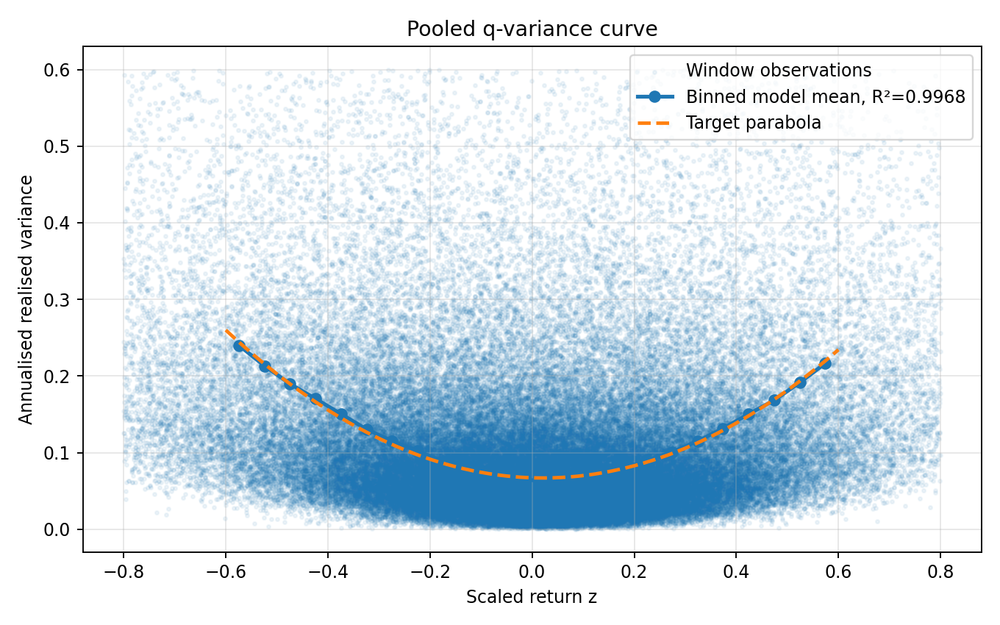
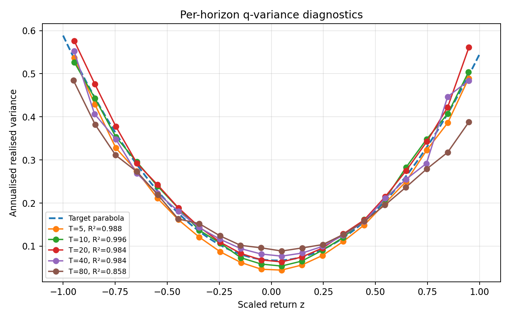
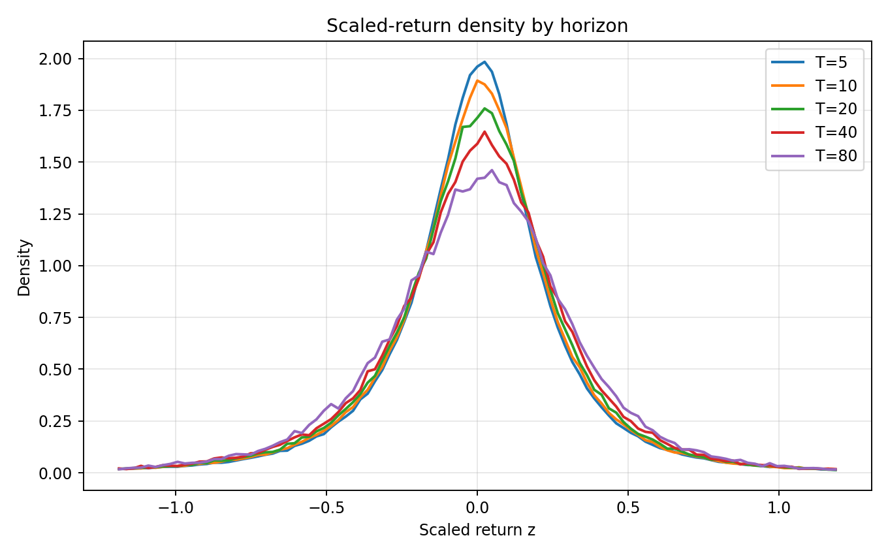
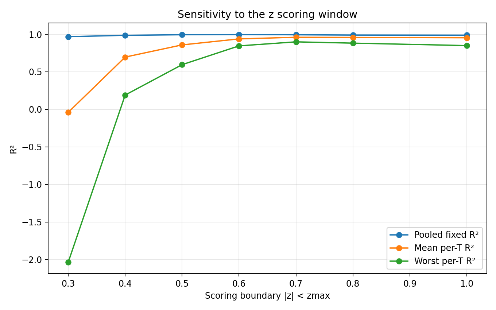
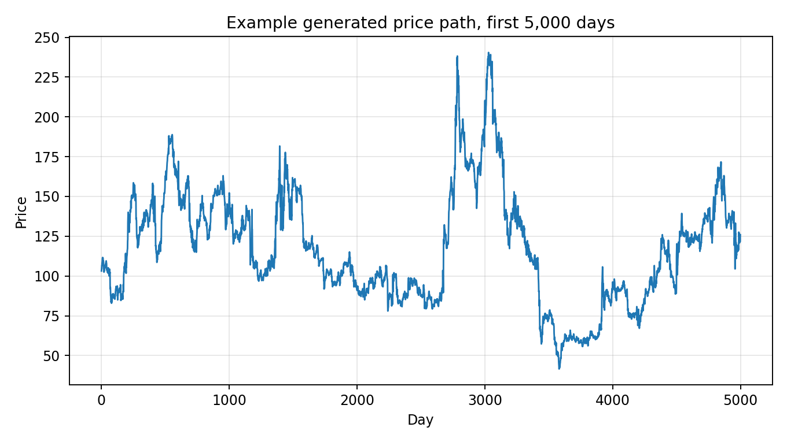

# Coherent inverse-chi-square Hermite-energy model

This is a three-parameter stochastic price generator for the Q-Variance Challenge. It generates a single daily price path and writes it as `variance_timeseries.csv` with one `Price` column.

The model represents market variance as a persistent activity field. The activity has two linked components: a persistent inverse-chi-square market-activity field and a Hermite-energy feedback field. The first component gives persistent volatility regimes; the second links large daily shocks to realised variance.

## Parameters

The submitted calibration uses three fitted parameters:

```text
beta_mult = 1.719800
memory    = 15.275991
eta       = 0.498969
```

```text
beta_mult   annual variance scale, expressed relative to the challenge volatility unit
memory      persistence scale of the latent activity fields, in trading days
eta         strength of the Hermite-energy feedback
```

The seed fixes the generated path for reproducibility.

## Model definition

Let the daily innovation be

```math
\epsilon_t \sim N(0,1).
```

The persistence coefficient is

```math
\rho = \exp(-1/m),
```

where \(m\) is the `memory` parameter.

### Persistent market activity

Generate a persistent Gaussian field:

```math
U_t = \rho U_{t-1} + \sqrt{1-\rho^2}\,\xi_t,
\qquad \xi_t \sim N(0,1).
```

Map it through a Gaussian copula into a three-dimensional inverse-radius activity variable:

```math
p_t = \Phi(U_t),
\qquad
Q_t = F^{-1}_{\chi^2_3}(p_t).
```

The baseline activity is

```math
A^{(0)}_t = \frac{1}{Q_t},
```

renormalised to sample mean one. This gives a persistent inverse-chi-square, or inverse-gamma-type, activity environment.

### Hermite-energy feedback

The even Hermite energy of the daily innovation is

```math
H_2(\epsilon_t)=\epsilon_t^2-1.
```

The feedback driver is

```math
D_t =
\frac{H_2(\epsilon_t)}{\sqrt{2}}
-
\frac{\eta^2}{\sqrt{2}}\epsilon_t.
```

The odd component is tied to the same coupling parameter \(\eta\). This gives a coherent shift of the conditional-variance curve without introducing a separate tilt parameter.

After standardisation, the driver is filtered with the same persistence coefficient:

```math
F_t = \rho F_{t-1}+\sqrt{1-\rho^2}\,\widetilde D_t.
```

The Hermite-energy multiplier is

```math
M_t = \exp(\eta F_t),
```

renormalised to sample mean one.

The total activity is

```math
A_t =
\frac{A^{(0)}_t M_t}{\langle A^{(0)}M\rangle}.
```

The daily log return is

```math
r_t =
\sqrt{
\frac{
\beta_{\rm mult}\sigma_0^2 A_t
}{252}
}
\,\epsilon_t,
```

with the sample mean removed. Here \(\sigma_0=0.2586\) is used as the challenge volatility unit, so the free annual variance scale is equivalently

```math
\beta = \beta_{\rm mult}\sigma_0^2.
```

The price path is

```math
P_t =
P_0\exp\left(\sum_{s\le t}r_s\right).
```

## Market interpretation

The inverse-chi-square activity field represents persistent variation in market activity: liquidity, positioning, leverage pressure, margin constraints and order-flow imbalance. The activity is heavy-tailed, but it also has memory, so volatility regimes persist across several trading days.

The Hermite-energy feedback represents the fact that large shocks are not isolated events in a realistic market path. Large innovations tend to occur in states where realised variance is elevated, and they also affect subsequent activity. This links endpoint moves and realised variance more strongly than a conditionally independent volatility mixture.

## Results

The figures below were generated from a 5,000,000-day simulation with the parameters above and seed 5.

### Pooled q-variance curve



The pooled fixed-parabola score over the public scoring window \(|z|<0.6\) is:

```text
R2 = 0.996831
```

### Per-horizon q-variance diagnostics



Diagnostic \(R^2\) values over \(|z|<1.0\), using \(T=5,10,20,40,80\):

```text
T = 5    R2 = 0.988047
T = 10   R2 = 0.996026
T = 20   R2 = 0.983928
T = 40   R2 = 0.984238
T = 80   R2 = 0.858349
```

### Scaled-return density by horizon



### Sensitivity to the scoring window



### Example generated price path



## Files

```text
coherent_ig_energy_submission.py     model and price-series generator
variance_timeseries_100k.csv         short sample for checking the CSV format
model_parameters.json                calibrated parameter values
requirements.txt                     Python dependencies
validation_metrics.txt               metrics used for the figures
figures/                             output figures from the 5,000,000-day diagnostic run
```

## Reproduce the submitted series

Install dependencies:

```bash
pip install -r requirements.txt
```

Generate the full 5,000,000-day price series:

```bash
python coherent_ig_energy_submission.py --n 5000000 --seed 5 --out variance_timeseries.csv --summary-out full_submission_summary.csv
```

Then run the public challenge loader and scorer on `variance_timeseries.csv`.

The included `variance_timeseries_100k.csv` is only a short format check. The full-length series should be regenerated before scoring.
