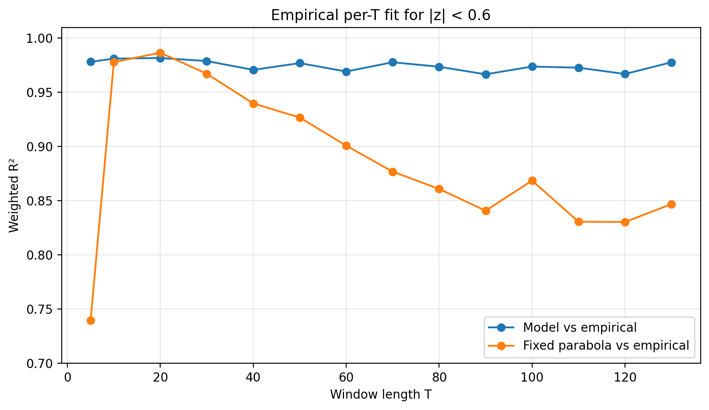
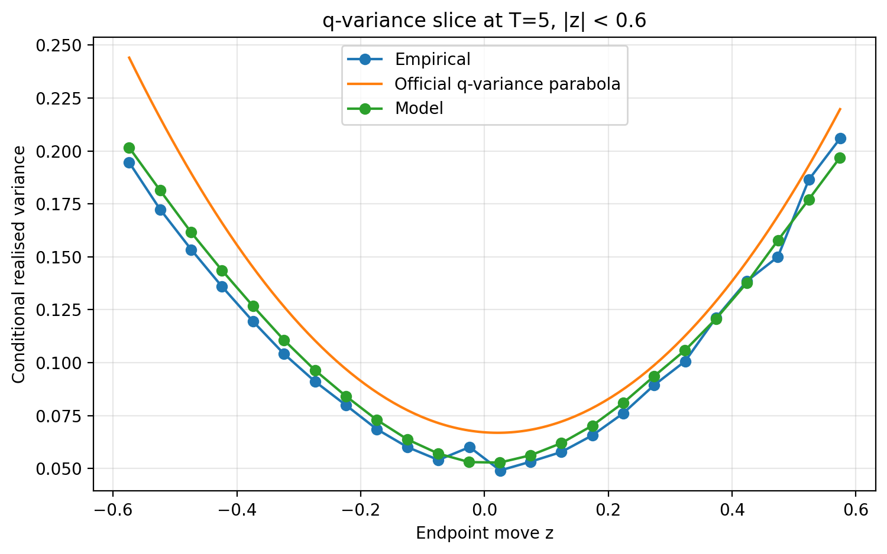
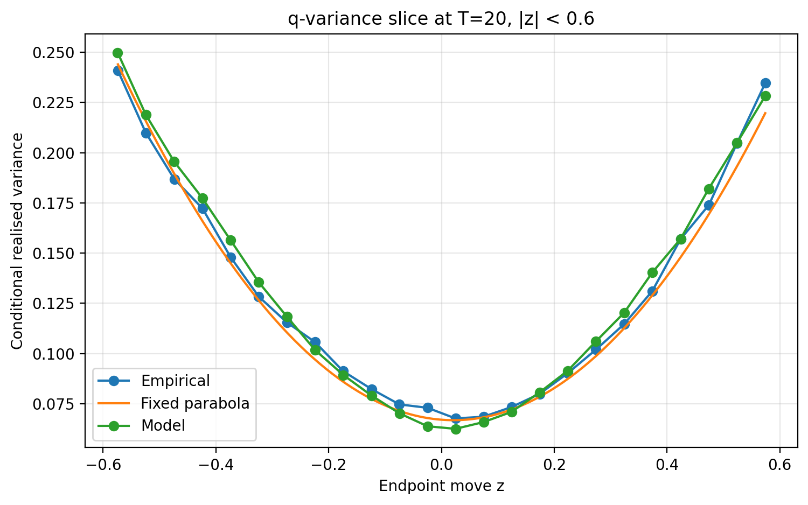
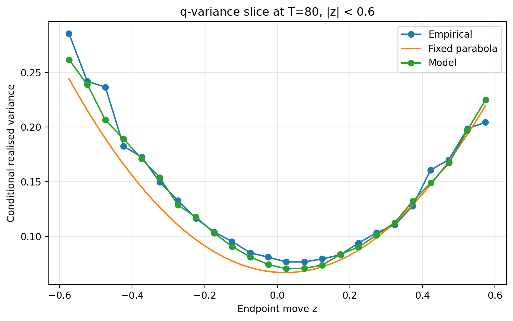
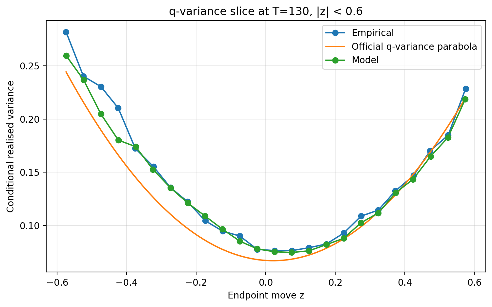
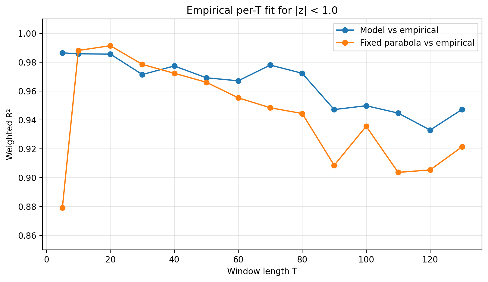

# Three-parameter noncommutative bath model for q-variance

This submission gives a **three-parameter path generator** for the q-variance challenge. It is a stochastic process for full price paths, not only a fitted static curve.

| parameter | value |
|---|---:|
| $\beta_{\mathrm{mult}}$ | 2.028391 |
| $\mathrm{memory}$ | 110.393674 |
| $\eta$ | 1.091468 |

The local 5M optimisation gives pooled official q-variance $R^2$ above **0.995**.

| official-target metric | value |
|---|---:|
| $R^2_{\mathrm{fixed,mean}}$ | 0.995813 |
| $R^2_{\mathrm{fixed,min}}$ | 0.995337 |
| $R^2_{\mathrm{fixed,max}}$ | 0.996453 |
| $R^2_{\mathrm{fixed,std}}$ | 0.000400 |

## Main claim

The model reaches the challenge target: pooled official q-variance $R^2$ above **0.995**.

In addition, it gives a more $T$-stable empirical fit than the official q-variance parabola. The official q-variance parabola is $T$-invariant as a formula, but its empirical goodness-of-fit is not equally stable across individual window lengths. This path model gives a more stable fit to the empirical q-variance surface $Q(z,T)$.

## Market interpretation

The model can be read as a simple market-state model. Prices do not move only because of today’s random shock. They move inside a market environment that remembers recent pressure, activity, and imbalance.

Each daily innovation is split into two components. The first component measures the intensity of the day, regardless of direction: quiet, ordinary, or high-information. The second component keeps the sign of the pressure: upward or downward. The hidden bath is a persistent memory of these signed and unsigned shocks.

The hidden bath represents market activity or pressure. When the bath state is high, the market is more active and daily variance is higher. When it is low, the market is quieter. The parameter $\mathrm{memory}$ controls how long this state persists, $\eta$ controls how strongly it affects volatility, and $\beta_{\mathrm{mult}}$ sets the overall variance scale.

The order-flow part means that the order of events matters. A large activity shock followed by directional pressure is not treated as identical to directional pressure followed by a large activity shock. This is meant to capture the fact that volatility, liquidity, and directional pressure do not commute in real trading: the same ingredients can have different effects depending on their sequence.

This produces q-variance because the endpoint move over a window and the realised variance inside that window are driven by the same persistent hidden market state. A large endpoint move is more likely to have occurred during an elevated-activity regime, which raises the conditional realised variance.

> The official q-variance parabola is the pooled statistical signature. This model is a possible dynamic mechanism behind it.

## Model definition

Let $\varepsilon_t$ be an i.i.d. standard normal innovation. Define an even activity channel and an odd signed-pressure channel:

$$E_t = \frac{\varepsilon_t^2 - 1}{\sqrt{2}}, \qquad O_t = \varepsilon_t.$$

The even channel $E_t$ is large on unusually active days, independently of sign. The odd channel $O_t$ keeps the direction of the pressure.

The baseline bath driver is

$$D_t = E_t - \tanh(\eta)\,O_t.$$

The persistent baseline bath is

$$F_{0,t} = \rho F_{0,t-1} + \sqrt{1-\rho^2}\,D_{t-1}.$$

$$\rho = \exp\!\left(-\frac{1}{\mathrm{memory}}\right).$$

The one-day lag makes the bath causal, while $\mathrm{memory}$ sets how slowly the hidden market state decays. With the submitted value $\mathrm{memory}\approx110$, the bath remains coherent across many trading windows rather than resetting each day.

The two order-flow channels are

$$C_t = E_{t-1}O_{t-2} - O_{t-1}E_{t-2}.$$

$$S_t = E_{t-1}O_{t-2} + O_{t-1}E_{t-2}.$$

$C_t$ is the antisymmetric, commutator-like term. $S_t$ is the symmetric partner. Together they let the hidden state respond not only to what happened recently, but also to the order in which activity and signed pressure arrived.

After removing the overlap of these channels with the baseline bath, the submitted hidden state is

$$F_t = \mathrm{std}\!\left(F_{0,t} + C_t^{\perp} - \tanh(\eta)\,S_t^{\perp}\right).$$

The hidden state controls the daily activity multiplier:

$$A_t = \frac{\exp(\eta F_t)}{\mathrm{E}[\exp(\eta F_t)]}.$$

Returns are generated as

$$r_t = \sqrt{\frac{\beta_{\mathrm{mult}}\sigma_0^2 A_t}{252}}\;\varepsilon_t.$$

## Parameter count

The model has exactly three numerical parameters:

$$\beta_{\mathrm{mult}},\qquad \mathrm{memory},\qquad \eta.$$

There are no separately fitted shape parameters, cutoffs, caps, lookup tables, horizon-specific adjustments, or hidden calibration constants. The equations above are the model definition.

## Official score

The official target is the pooled official q-variance curve. With the parameter set above, the current local 5M result is

$$R^2_{\mathrm{fixed,mean}} = 0.995813,\qquad R^2_{\mathrm{fixed,min}} = 0.995337.$$

This is the result intended for the challenge ranking.

## $T$-invariance and empirical window dependence

The official q-variance parabola is $T$-invariant by construction. Empirically, however, its fit varies substantially across individual window lengths. The proposed process gives a more stable per-window empirical fit.

### Central range: $|z| < 0.6$

| $T$ | model vs empirical | official q-variance parabola vs empirical | model gain |
|---:|---:|---:|---:|
| 5 | 0.978292 | 0.739738 | 0.238555 |
| 10 | 0.981181 | 0.977943 | 0.003238 |
| 20 | 0.981770 | 0.986658 | -0.004889 |
| 40 | 0.970829 | 0.939829 | 0.031000 |
| 80 | 0.973695 | 0.860966 | 0.112730 |
| 130 | 0.977794 | 0.846932 | 0.130862 |

Summary across all $T$ slices:

| metric | model | official q-variance parabola |
|---|---:|---:|
| mean per-$T$ $R^2$ | 0.974796 | 0.885335 |
| minimum per-$T$ $R^2$ | 0.966724 | 0.739738 |
| standard deviation across $T$ | 0.004780 | 0.066584 |
| range across $T$ | 0.015046 | 0.246921 |
| $T$-slices won by model | 13/14 | — |

Selected q-variance slices:

### Wider robustness range: $|z| < 1.0$

| $T$ | model vs empirical | official q-variance parabola vs empirical | model gain |
|---:|---:|---:|---:|
| 5 | 0.986482 | 0.879179 | 0.107303 |
| 10 | 0.985774 | 0.988109 | -0.002335 |
| 20 | 0.985602 | 0.991417 | -0.005815 |
| 40 | 0.977375 | 0.972311 | 0.005064 |
| 80 | 0.972307 | 0.944460 | 0.027847 |
| 130 | 0.947315 | 0.921455 | 0.025861 |

Summary across all $T$ slices:

| metric | model | official q-variance parabola |
|---|---:|---:|
| mean per-$T$ $R^2$ | 0.965389 | 0.942759 |
| minimum per-$T$ $R^2$ | 0.933024 | 0.879179 |
| standard deviation across $T$ | 0.017000 | 0.033750 |
| range across $T$ | 0.053458 | 0.112238 |
| $T$-slices won by model | 11/14 | — |

The wider range is not the main optimisation target; it is included as a robustness check.
