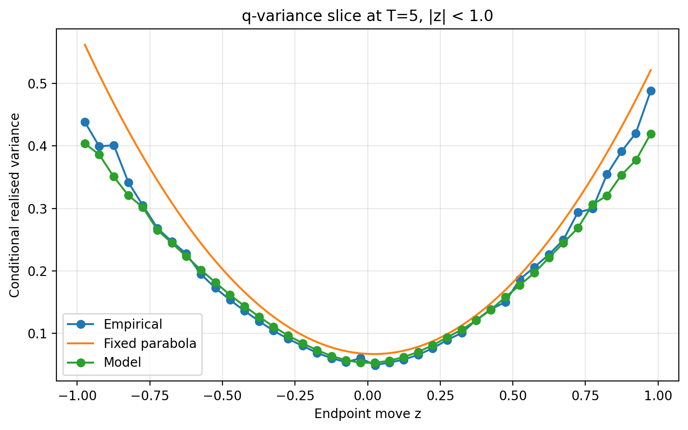
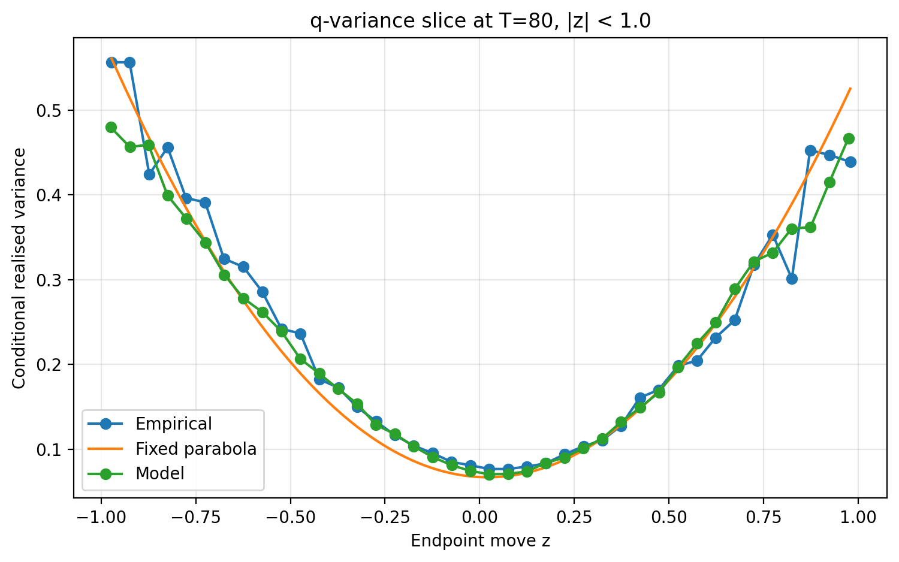

# Three-parameter noncommutative bath model for q-variance

This submission uses a three-parameter stochastic process for generating price paths with q-variance structure. The model is a non-inverse-gamma hidden-activity bath with order-flow corrections.

Current submitted parameter set:

| parameter | value |
|---|---:|
| `mode` | `sym_neg_tanh` |
| `beta_mult` | 2.028391 |
| `memory` | 110.393674 |
| `eta` | 1.091468 |

Current 5M local official-target optimisation:

| metric | value |
|---|---:|
| `fixed_mean` | 0.995813 |
| `fixed_min` | 0.995337 |
| `fixed_max` | 0.996453 |
| `fixed_std` | 0.000400 |

The current run is above `0.995` both in mean and worst-seed official pooled fixed R².

## Main claim

The fixed q-variance parabola is T-invariant as a formula. It also remains an excellent fit to the pooled empirical central curve. The claim here is different: when empirical q-variance is evaluated separately by window length, the fixed parabola's goodness-of-fit varies substantially across T. The proposed path model gives a more T-stable fit to the empirical q-variance surface `Q(z,T)`.

So the comparison is not “which curve draws the prettier pooled parabola?” The comparison is whether a path process can reproduce the empirical family of conditional variance curves across window lengths.

## Model structure

Let the innovation be `eps_t`. Define the even and odd channels:

```text
E_t = (eps_t^2 - 1) / sqrt(2)
O_t = eps_t
```

The baseline driver is

```text
D_t = E_t - tanh(eta) O_t
```

with persistent bath state

```text
F0_t = AR1(D_(t-1); memory)
```

The two order-flow channels are

```text
C_t = E_(t-1) O_(t-2) - O_(t-1) E_(t-2)
S_t = E_(t-1) O_(t-2) + O_(t-1) E_(t-2)
```

`C_t` is the antisymmetric/commutator-like term. `S_t` is the symmetric partner. After orthogonalising these against the baseline bath, the submitted hidden state is

```text
F_t = std(F0_t + C_t_perp - tanh(eta) S_t_perp)
```

The activity multiplier is

```text
A_t = exp(eta F_t) / mean(exp(eta F_t))
```

and returns are generated as

```text
r_t = sqrt(beta_mult * sigma0^2 * A_t / 252) * eps_t
```

Only three numerical parameters are exposed:

```text
beta_mult, memory, eta
```

The channel definitions, orthogonalisation rule, signs, and `tanh(eta)` coupling are fixed architectural choices.

## Official score

The official challenge score is the pooled fixed-parabola q-variance score. The current local 5M optimisation gives:

```text
fixed_mean = 0.995813
fixed_min  = 0.995337
```

This is the parameter set to submit for the challenge target.

## Empirical T-stability

The empirical comparison below uses two tests:

1. `|z| < 0.6`, the central range closest to the official q-variance target.
2. `|z| < 1.0`, a wider robustness range including more higher-order empirical structure.

### Per-T fit, |z| < 0.6

| T | model vs empirical | fixed parabola vs empirical | model gain |
|---:|---:|---:|---:|
| 5 | 0.978292 | 0.739738 | 0.238555 |
| 10 | 0.981181 | 0.977943 | 0.003238 |
| 20 | 0.981770 | 0.986658 | -0.004889 |
| 40 | 0.970829 | 0.939829 | 0.031000 |
| 80 | 0.973695 | 0.860966 | 0.112730 |
| 130 | 0.977794 | 0.846932 | 0.130862 |

Summary across all T slices:

| metric | model | fixed parabola |
|---|---:|---:|
| mean per-T R² | 0.974796 | 0.885335 |
| min per-T R² | 0.966724 | 0.739738 |
| std across T | 0.004780 | 0.066584 |
| range across T | 0.015046 | 0.246921 |
| T-slices won by model | 13/14 | — |


The line chart above is the main empirical diagnostic. It shows that the model's empirical R² is much more stable across window lengths.

### q-variance slices, |z| < 0.6

These plots show individual T-slices rather than the pooled curve. This is the clearer visual comparison because the claim is about the empirical surface `Q(z,T)`, not only the pooled projection.


### Robustness check, |z| < 1.0

| T | model vs empirical | fixed parabola vs empirical | model gain |
|---:|---:|---:|---:|
| 5 | 0.986482 | 0.879179 | 0.107303 |
| 10 | 0.985774 | 0.988109 | -0.002335 |
| 20 | 0.985602 | 0.991417 | -0.005815 |
| 40 | 0.977375 | 0.972311 | 0.005064 |
| 80 | 0.972307 | 0.944460 | 0.027847 |
| 130 | 0.947315 | 0.921455 | 0.025861 |

Summary across all T slices:

| metric | model | fixed parabola |
|---|---:|---:|
| mean per-T R² | 0.965389 | 0.942759 |
| min per-T R² | 0.933024 | 0.879179 |
| std across T | 0.017000 | 0.033750 |
| range across T | 0.053458 | 0.112238 |
| T-slices won by model | 11/14 | — |


Selected wider-range slices:





## Why the pooled curve is not the headline

A pooled q-variance curve averages over window length. That is exactly where the fixed parabola is expected to look best. The path model has a harder job: it must generate a coherent family of curves across T, not just the pooled average.

For that reason the pooled empirical curve is useful as a sanity check, but it is not the central evidence for the process. The central evidence is the per-T empirical comparison and the separate T-slice curves.

## Local scoring commands

Generate one price path for the official scorer:

```powershell
python strict_three_param_noncomm_antisym_bath_model.py --mode sym_neg_tanh --n 5000000 --seed 1 --beta-mult 2.028391 --memory 110.393674 --eta 1.091468 --out-prefix final_symneg_seed1 --out-price final_symneg_seed1_prices.csv --quiet
```

Then run the local official scorer on:

```text
final_symneg_seed1_prices.csv
```

The exact command depends on your scorer filename, usually one of:

```powershell
python score_run.py final_symneg_seed1_prices.csv
python score.py final_symneg_seed1_prices.csv
python score_run.py --price-file final_symneg_seed1_prices.csv
```

To reproduce the local multi-seed fixed score used during optimisation, create a one-row parameter file:

```powershell
@"
mode,beta_mult,memory,eta,objective
sym_neg_tanh,2.028391,110.393674,1.091468,0
"@ | Set-Content final_symneg_params.csv
```

Then rerank:

```powershell
python bo_noncomm_antisym_bath_robust_invariance.py --rerank-input final_symneg_params.csv --n 5000000 --seeds 1,2,3,4,5 --seed-policy crn --objective-kind blend --min-weight 0.65 --lcb-k 0.25 --top 1 --std-weight 0.0 --min-penalty 0.0 --perT-mean-weight 0.0 --perT-min-weight 0.0 --perT-std-weight 0.0 --zdist-mean-weight 0.0 --zdist-min-weight 0.0 --log-range-weight 0.0 --out-prefix local_score_final_symneg_5M
```

Inspect:

```powershell
python -c "import pandas as pd; df=pd.read_csv('local_score_final_symneg_5M_best30.csv'); cols=['mode','beta_mult','memory','eta','fixed_mean','fixed_min','fixed_max','fixed_std','T5_fixed_mean','T10_fixed_mean','T20_fixed_mean','T40_fixed_mean','T80_fixed_mean']; print(df[cols].to_string(index=False))"
```

## Final checks before PR

- Rerun the empirical comparison with the final parameter set if the charts were generated from an earlier empirical-check file.
- Add exact official scorer output.
- Add seven-seed rerank if available.
- Keep the pooled empirical plot out of the main README unless explicitly framed as a pooled-only sanity check.
