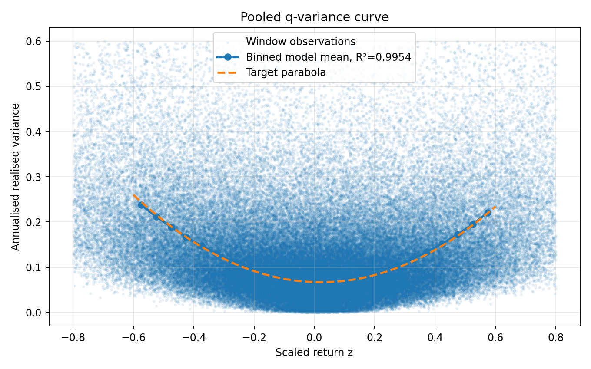
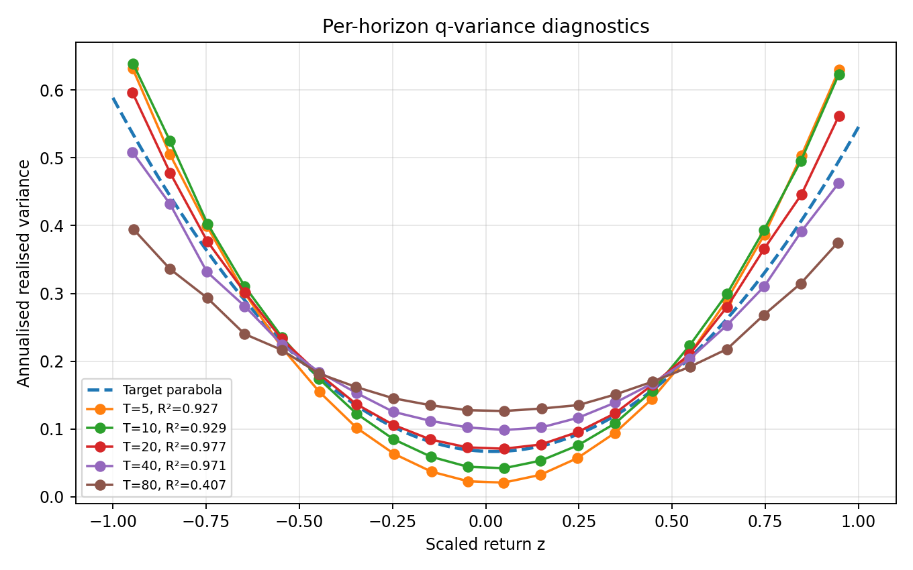
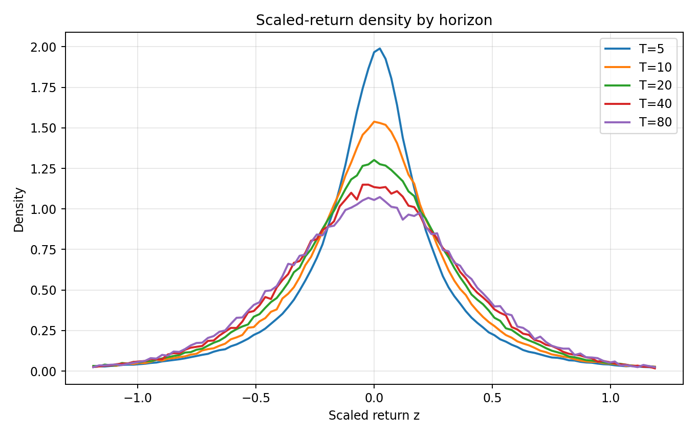
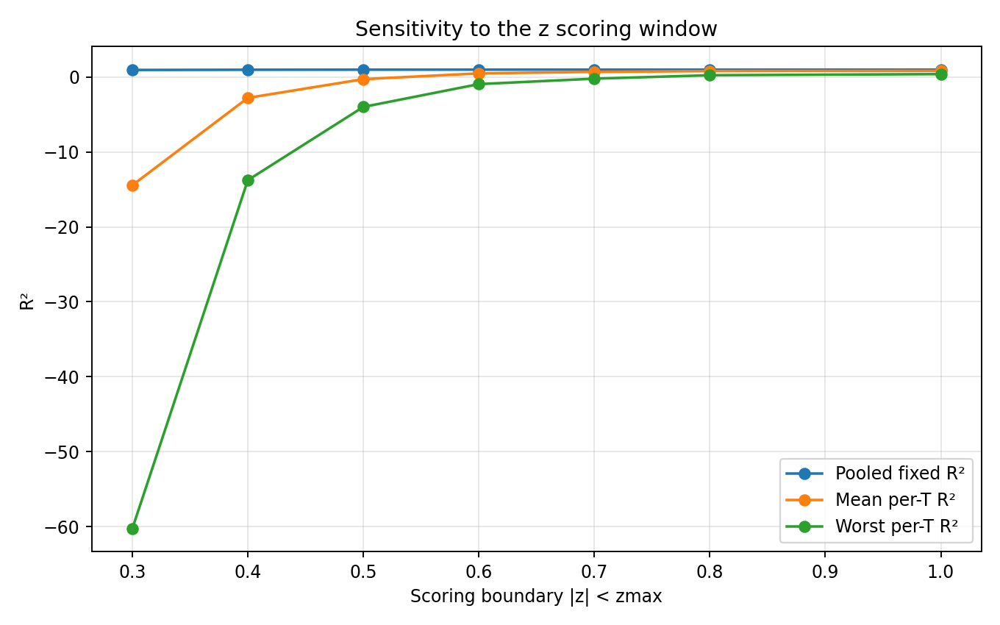
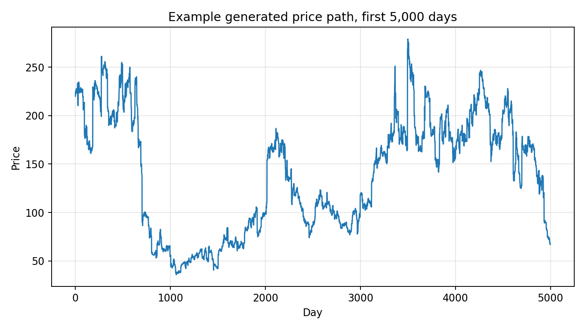

# Phase-Hermite cos2 oscillator model

This submission contains a three-parameter stochastic price generator for the Q-Variance Challenge. It generates a single daily price path and writes it as `variance_timeseries.csv` with one `Price` column.

The model combines a compact latent phase state with Hermite-deformed Gaussian shocks. The phase lives on a circle and determines market activity through a second-order Fourier form. Daily shocks both move the price and rotate the latent activity state.

## Parameters

The model has three parameters:

```text
beta_mult = 2.645106721716812
g         = 1.68520494798523
eta       = 0.2341884778705525
```

```text
beta_mult   annual variance scale, expressed relative to the challenge volatility unit
g           amplitude of the phase/activity oscillation
eta         Hermite deformation strength and phase-response strength
```

The random seed fixes the generated path for reproducibility.

## Model definition

Let the daily Gaussian innovation be

```math
\epsilon_t \sim N(0,1).
```

The hidden state is an angle on the circle,

```math
\theta_t \in [0,2\pi).
```

It evolves according to

```math
\theta_{t+1}
=
\theta_t+\Omega-\eta \epsilon_t
\pmod{2\pi},
```

with

```math
\Omega=\pi(3-\sqrt{5}).
```

The local activity is generated by the second-order phase form

```math
\log A_t
=
g\left(\cos\theta_t+\frac12\cos(2\theta_t)\right).
```

The activity is normalised to sample mean one:

```math
A_t \leftarrow \frac{A_t}{\langle A\rangle}.
```

The daily shock is deformed in the Hermite basis. Define

```math
H_2(\epsilon)=\epsilon^2-1,
\qquad
H_3(\epsilon)=\epsilon^3-3\epsilon.
```

The transformed shock is

```math
Y_t
=
\frac{
\epsilon_t+\eta\left(H_3(\epsilon_t)-0.10H_2(\epsilon_t)\right)
}{
\sqrt{1+\eta^2(6+2\cdot0.10^2)}
}.
```

The denominator standardises \(Y_t\) to unit variance.

The daily log return is

```math
r_t =
\sqrt{
\frac{
\beta_{\rm mult}\sigma_0^2 A_t
}{252}
}
Y_t,
```

with the sample mean removed. Here \(\sigma_0=0.2586\) is the challenge volatility unit, so the free annual variance scale is equivalently

```math
\beta = \beta_{\rm mult}\sigma_0^2.
```

The price path is

```math
P_t =
P_0\exp\left(\sum_{s\le t}r_s\right).
```

## Market interpretation

The hidden phase can be interpreted as a compact market state. Liquidity, positioning, risk appetite, order-flow imbalance and market stress are represented by a state moving on a circle rather than by an unbounded volatility variable.

The second-order phase activity creates calm and active regions on this circle. The return shock changes the next phase, so a large move does not disappear immediately; it rotates the market into a different activity state. The Hermite deformation gives the daily shock a controlled non-Gaussian form in the natural Gaussian polynomial basis.

## Results

The figures below were generated from a 5,000,000-day simulation with the parameters above and seed 1.

### Pooled q-variance curve



For this seed, the pooled fixed-parabola score over the public scoring window \(|z|<0.6\) is:

```text
R2 = 0.995388
```

A 5,000,000-day rerank over nine seeds gave:

```text
fixed_mean = 0.9954022513
fixed_min  = 0.9950290953
fixed_std  = 0.0002934915
```

### Per-horizon q-variance diagnostics



Diagnostic \(R^2\) values over \(|z|<1.0\), using \(T=5,10,20,40,80\):

```text
T = 5    R2 = 0.926637
T = 10   R2 = 0.929214
T = 20   R2 = 0.976566
T = 40   R2 = 0.971171
T = 80   R2 = 0.407085
```

### Scaled-return density by horizon



### Sensitivity to the scoring window



### Example generated price path



## Files

```text
cos2_phase_hermite_submission.py     model and price-series generator
variance_timeseries_100k.csv         short sample for checking the CSV format
model_parameters.json                parameter values
requirements.txt                     Python dependencies
validation_metrics.txt               metrics used for the figures
figures/                             output figures from the 5,000,000-day diagnostic run
```

## Reproduce the submitted series

Install dependencies:

```bash
pip install -r requirements.txt
```

Generate the full 5,000,000-day price series:

```bash
python cos2_phase_hermite_submission.py --n 5000000 --seed 1 --out variance_timeseries.csv --summary-out full_submission_summary.csv
```

Then run the public challenge loader and scorer on `variance_timeseries.csv`.

The included `variance_timeseries_100k.csv` is only a short format check. The full-length series should be regenerated before scoring.
