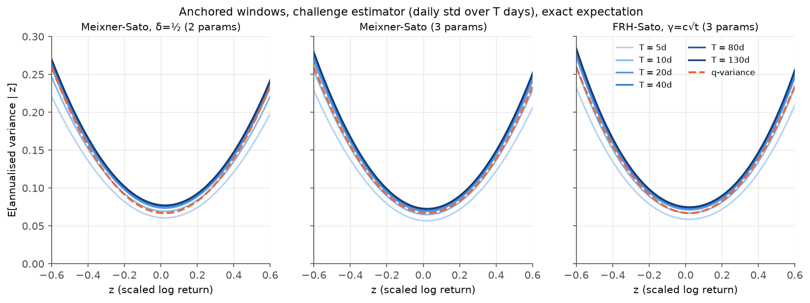
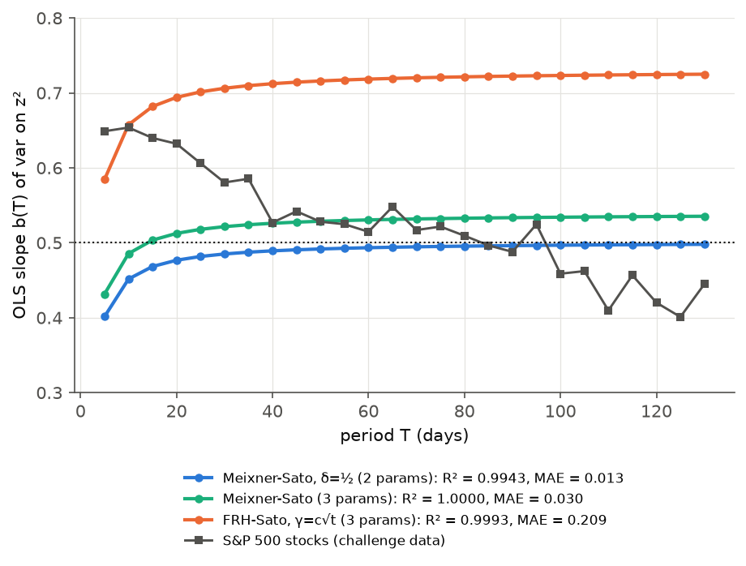

# Submission: rmcrkd_sato

**Team name:** rmcrkd_sato

**Contact:** Ryan McCrickerd ([@rmcrkd](https://github.com/rmcrkd))

**How this entry was made:** everything here (the analysis, the theory, the code, the numbers and this README) was produced by Claude (Anthropic's Claude Opus 5, in Claude Code) from **one prompt** by Ryan McCrickerd, quoted in full below. Ryan's only other input was asking for the work to be committed and then packaged as this submission. The FRH model comes from Ryan's earlier repo [rmcrkd/frh-fx](https://github.com/rmcrkd/frh-fx) (2018). The Meixner result, the Fourier identity and all the code in `qfrh/` were derived and written by Claude in that session. Ryan has not verified the theory independently.

> Take a look at the challenge at https://github.com/q-variance/challenge.
> One of the early entries to this used some of my code from https://github.com/rmcrkd/rough_bergomi.
> Given the "maturity invariance" apparently evident in the problem, I would like to know how some other code of mine performs, specifically that from https://github.com/rmcrkd/frh-fx.
> I am especially interested in the "delta symmetry" setup there (with gamma growing like t^0.5), eg shown in the README there and generated in the 5-symmetry notebook.
> As I understand, this model would not provide a solution to the challenge, since it is not a continuous model (rather, and additive NIG process), but it might lead us to a relationship between q-variance and implied volatility symmetries.
>
> I you make good progress, prepare a submission to the challenge, per that repo's README.
>
> Use this repo with python and markdown as you think best.

**Model:** additive (independent-increment) Sato processes of index ½: the FRH/NIG "delta symmetry" model from [rmcrkd/frh-fx](https://github.com/rmcrkd/frh-fx), and the Meixner process it points to.

**Claim:** an honourable-mention entry, not a claim on the prize. On windows that start at the process origin, the model reproduces q-variance and its T-invariance with 3 parameters. It is **not stationary**: as a single daily price series it fails, and we say why below. The main contribution is an exact relationship between q-variance, implied-volatility smiles, and the model family.

## Model

Log-price X_t is a centred Sato process: an additive process with X_{λt} equal in law to √λ·X_t. Its law at horizon T is Meixner:

φ_T(p) = [ cos(β/2) / cosh(A√T·p − iβ/2) ]^{2δ} · e^{iμ_T p},

with μ_T chosen so that E X_T = 0. Daily increments are independent but not identically distributed.

Declared parameters (3):

| Parameter | Role | Value |
| --- | --- | --- |
| A | scale, sets the minimum volatility σ₀ | 0.4297 |
| β | skew, sets the offset z₀ | −0.1172 |
| δ | shape, sets the curvature q | 0.4298 |

Structural choices, declared for transparency:

- **Index ½.** This is the only index that keeps the law of z = x/√T independent of T, so it is set by the challenge's own scaling, not tuned.
- **Anchoring.** See "Limitation".

## Why Meixner: exact result

For any process with independent increments, E[QV_T · e^{ipX_T}] = −Ψ_T''(p)·φ_T(p), where Ψ = log φ. Requiring E[QV_T | X_T = x] = σ₀²T + q(x − x₀)² for all x gives a Riccati equation. Its unique solution is **Meixner with δ = (1 − q)/(2q)**.

So the q-variance coefficient **q = ½ corresponds exactly to δ = ½** (a skewed hyperbolic secant law). Then:

- A = σ₀√2 and β = −2·arctan(z₀/(σ₀√2)), so the model needs only the parabola's own two parameters.
- A Lévy process has δ_T ∝ T, so q decays with T.
- A Sato process keeps δ fixed, so q is T-invariant.

In option terms, the Sato scaling is a smile that is invariant across maturities when plotted against delta (the "delta symmetry" of frh-fx). So under independent increments, *T-invariant q-variance* ⇔ *delta-symmetric smile*, and *q = ½* ⇔ *smile shape Meixner(δ = ½)*.

The challenge estimator (np.std over T daily returns) lowers the curvature by about 1/T. With δ = ½ and only A and β fitted, R² = 0.9943. Letting δ = 0.43 absorbs the bias.

## Results

`dataset.parquet` holds anchored windows: for each T = 5, …, 130, there are 5,000,000/T independent windows of T days, each starting at the process origin. That is 3.85M windows. Official `code/score_submission.py`, unmodified:

- **R² = 0.9999** against σ₀ = 0.2586, z₀ = 0.0214.
- Free fit: σ₀ = 0.2585, z₀ = 0.0211, q = 0.499.
- **b(T) MAE = 0.030**. b(T) rises from 0.43 at T = 5 to about 0.53 by T = 20, then stays flat.

| Model (anchored) | Params | R² | MAE b(T) |
| --- | --- | --- | --- |
| Meixner-Sato (this entry) | A, β, δ | 0.9999 | 0.030 |
| Meixner-Sato, δ = ½ | A, β | 0.9943 | 0.022 |
| FRH-Sato (frh-fx, γ(t) = c√t) | σ, ρ, c | 0.9984 | 0.201 |

## Finite variance-of-variance

The [end-2025 summary](../../subsummary.md) argues that exact q-variance forces infinite variance-of-variance. It assumes z | V is Gaussian and that the realised variance *is* the mixing variance V. That assumption fails for pure-jump processes. Here z | V is Gaussian (X is Brownian motion run on a subordinator clock), and V has an exponential tail, so E[V | z] is subquadratic, as the summary says. But the realised variance over the window is not V: given the clock, it contains a z²·H term, where H measures how concentrated the clock's jumps are. E[QV | z] is exactly quadratic, and realised variance has an exponential tail with all moments finite.

Simulated anchored windows (T = 20) with 10⁵, 4·10⁵ and 1.6·10⁶ samples give the same moments of annualised variance each time: mean 0.127, standard deviation 0.185, kurtosis about 67. The maximum grows only logarithmically. So this model is not in the unstable regime of the inverse-gamma and GARCH entries. Its weakness is the one below.

## Limitation: not a stationary time series

An additive process is not stationary. A window that starts at time s ≫ T sees increments that are mostly zero with rare large jumps, so realised variance is dominated by one jump and b(T) → 1 − 1/T.

`prices_100k.csv` is the best single-series embedding available: the Sato clock restarts every 130 days, which counts as an extra parameter. Through `data_loader_csv.py` and `score_submission.py` it gives **R² = 0.873 and MAE = 0.21, a failure**. The same defect is known in option pricing: Sato models fit spot smiles across maturities but misprice forward-starting options.

What this identifies is a precise target for a dynamic model: a stationary process whose law, conditional on each date, is approximately Meixner(δ = ½)-Sato with a random scale. Mixing over the scale keeps the z² coefficient at exactly ½.

## How it compares with the other entries

| | Earlier entries (see [subtable](../../subtable.md)) | This entry |
| --- | --- | --- |
| Parameters | mostly 4–5, including caps or sampling rates | 3 (A, β, δ), or 2 with δ = ½ from theory |
| R² / b(T) MAE | none reach R² ≥ 0.995 with ≤ 3 parameters | 0.9999 / 0.030 (anchored); exact expected values, not a lucky seed |
| Convergence | inverse-gamma and GARCH: infinite variance-of-variance, slow convergence | all moments finite; the expected score is available in closed form |
| Single stationary series | yes | **no** (R² 0.87): the entry's main failure |
| Why q = ½ | usually a tuned shape (3/2) | a derived equivalence: q = ½ ⇔ Meixner δ = ½ |

We are not claiming the prize, because the challenge asks for a time series and this model does not produce a stationary one. We submit it for the theoretical results, which may help others build a dynamic model:

- q-variance ⇔ Meixner law for independent-increment processes;
- T-invariance ⇔ Sato scaling ⇔ delta-symmetric implied-vol smiles;
- a route to exact q-variance with finite variance-of-variance.

## Files

| File | Contents |
| --- | --- |
| `dataset.parquet` | anchored windows (ticker, date, T, z, sigma) |
| `prices_100k.csv` | single daily price series (column `Price`), clock restarted every 130 days |
| `qfrh/` | model code: exact Meixner sampler (`meixner.py`), FRH simulator (`model.py`), Fourier identity, exact expected scores and inverse-CDF sampler (`analytic.py`), challenge-matching scoring (`qvar.py`) |
| `make_submission.py`, `params.json` | regenerate everything (`python make_submission.py`, about 5 min) |
| `results.json` | all scores: expected, anchored, and single series with B = 130 and 252 |
| `smiles.png` | the implied-vol smiles these calibrations imply |

Requirements: numpy, scipy, pandas, pyarrow. The official scorer needs matplotlib < 3.9 because of `cm.get_cmap`.
