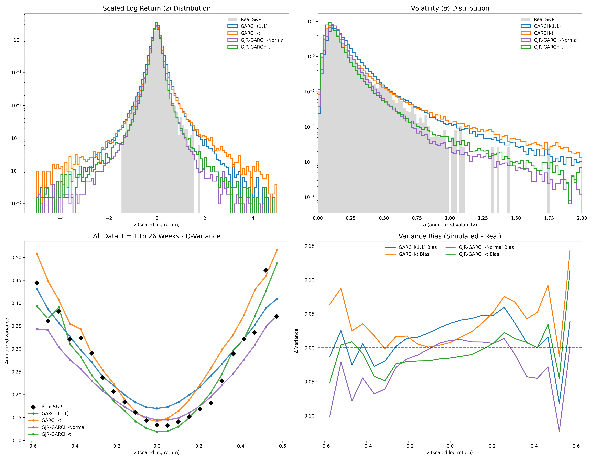

# S&P 500 Volatility Analysis: GJR and Student-t Dynamics

This project evaluates four GARCH-family models against historical S&P 500 data (1928–Present) using a high-fidelity **5,000,000-event simulation** per model. By analyzing the Q-variance Curve and Standardized Return distributions, we identify how specific model architectures reproduce the "physics" of market risk.

---

## 1. Introduction to Volatility Models

### A Nobel Prize Legacy: From ARCH to GARCH
Modern volatility modeling began with the **ARCH (Autoregressive Conditional Heteroskedasticity)** model, introduced by **Robert Engle** in 1982. This breakthrough proved that volatility is not constant but "conditional" on past shocks. Engle was awarded the **Nobel Memorial Prize in Economic Sciences** in 2003 for this work. **Tim Bollerslev**, a student of Engle, later generalized this into the **GARCH** model, which added a "memory" component (the previous variance) to the equation.

### A. The Baseline: GARCH(1,1)
The standard GARCH model assumes that current variance ($\sigma_t^2$) is a function of the long-term average ($\omega$), the most recent squared shock ($\epsilon_{t-1}^2$), and the previous variance ($\sigma_{t-1}^2$).

$$\sigma_t^2 = \omega + \alpha \epsilon_{t-1}^2 + \beta \sigma_{t-1}^2$$

* **Reference:** Bollerslev, T. (1986). "Generalized Autoregressive Conditional Heteroskedasticity." *Journal of Econometrics*.

### B. Accounting for Fat Tails: GARCH-t
Empirical returns exhibit **excess kurtosis** (shocks larger than a Normal distribution predicts). The GARCH-t model uses a **Student-t distribution** for innovations ($z_t$). This allows the model to capture extreme volatility spikes by assigning higher probability to "fat tails."
* **Reference:** Bollerslev, T. (1987). "A Conditionally Heteroskedastic Time Series Model for Speculative Prices and Rates of Return." *The Review of Economics and Statistics*.

### C. Capturing Asymmetry: GJR-GARCH
In equity markets, negative shocks typically increase volatility more than positive shocks (the **Leverage Effect**). The GJR model introduces an indicator function ($I_{t-1}$) that adds an additional penalty ($\gamma$) only when the previous return is negative.

$$\sigma_t^2 = \omega + (\alpha + \gamma I_{t-1}) \epsilon_{t-1}^2 + \beta \sigma_{t-1}^2$$

* **Reference:** Glosten, L. R., Jagannathan, R., & Runkle, D. E. (1993). "On the Relation between the Expected Value and the Volatility of the Nominal Excess Return on Stocks." *The Journal of Finance*.

### D. The Hybrid: GJR-GARCH-t
The **GJR-GARCH-t** combines the **asymmetric structural response** of GJR with the **fat-tailed innovation distribution** of the Student-t. This model attempts to solve both the "Leverage Effect" (asymmetry) and the "Volatility Clustering" (tails) problems simultaneously.

---

## 2. Model Calibration & Simulation

### Fit Methodology
The models were calibrated to **24,375 observations** of S&P 500 daily log-returns using **Maximum Likelihood Estimation (MLE)**. We utilize a constant mean model ($r_t = \mu + \epsilon_t$) and robust covariance estimators to ensure the parameters are resilient to the non-normality of market data.

### Simulation Scale and Comparison
Once calibrated, each model was used to generate a synthetic time series of **5,000,000 events**. This massive scale allows for a clear visualization of the **Q-variance Curve** and the population of extreme tail events. The simulated data is standardized and compared against the **Real S&P 500** benchmark.

### Final Parameter Comparison Table

| Model | $\alpha$ | $\beta$ | $\gamma$ | $\mu$ | $\nu$ | $\omega$ |
| :--- | :--- | :--- | :--- | :--- | :--- | :--- |
| **GARCH(1,1)** | 0.098 | 0.898 | N/A | 0.050 | N/A | 0.011 |
| **GARCH-t** | 0.087 | 0.910 | N/A | 0.062 | 5.719 | 0.008 |
| **GJR-GARCH-Normal** | 0.040 | 0.906 | 0.091 | 0.031 | N/A | 0.012 |
| **GJR-GARCH-t** | 0.031 | 0.909 | 0.103 | 0.050 | 6.008 | 0.010 |

### Visualization of Model Performance
The following multi-panel figure illustrates the distribution of standardized returns, the density of annualized volatility, and the resulting **Q-variance Curves**. These plots highlight how the structural differences in each model (asymmetry and tail thickness) manifest in large-scale simulations compared to historical S&P 500 behavior.

---

## 3. Comparative Analysis

### Structural Insights
* **Quadratic Variance Consistency:** All models demonstrate a dependence of variance on the scaled return ($z$) that is consistent with the **q-variance** framework. The parabolic **Q-variance Curve** confirms volatility as a quadratic function of the return shock.
* **The GJR Effect (Asymmetry):** GJR models successfully reproduce the asymmetry in the return distribution (Plot 1), reflecting the "bad news" bias where negative shocks increase volatility more than positive ones.
* **The Student-t Effect (Curvature):** The Student-t distribution results in a **narrower, steeper parabola** in the Q-variance Curve (Plot 3), agreeing better with the sharp sensitivity observed in the Real S&P 500 data.

---

## 4. Conclusion

The simulation results indicate that **no single model describes the historical data perfectly**. Each architecture possesses unique features: GJR captures the necessary structural asymmetry, while the Student-t distribution refines the curvature of the market's response to news. 

The accompanying [garch.ipynb](garch.ipynb) notebook contains the full experimental details, including the specific fit results, simulation logic, and comprehensive side-by-side comparisons of simulated and real-world statistics.

The empirical data suggests that market behavior is likely a **combination of several models** rather than a single mathematical process. While GJR-GARCH-t provides a flexible feature set, the variations in bias across the $z$-range suggest that the "true" market physics involve complex regimes that shift between these different model characteristics.